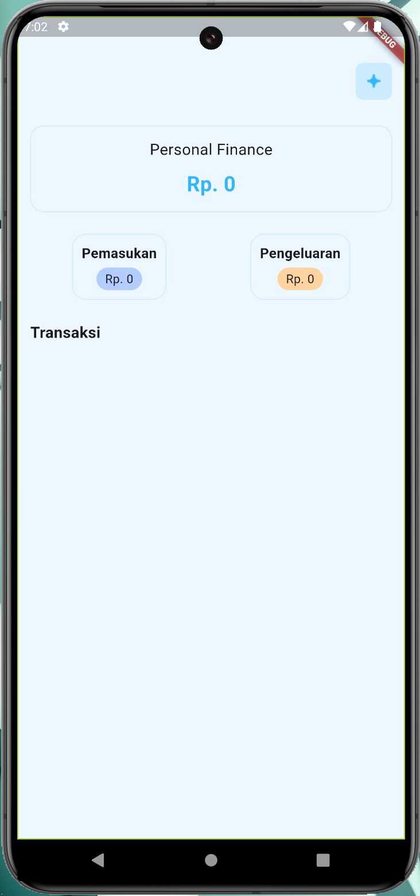

# Budget Management App

  
  

Aplikasi **Budget Management** adalah aplikasi mobile yang dirancang untuk membantu pengguna dalam mengelola keuangan pribadi mereka. Dengan fitur yang intuitif dan antarmuka yang user-friendly, aplikasi ini memungkinkan pengguna untuk mencatat pendapatan dan pengeluaran, memberikan wawasan yang jelas tentang anggaran, dan membantu dalam pengambilan keputusan keuangan yang lebih baik.

## Fitur Utama

- **Mencatat Pendapatan dan Pengeluaran**:

  - Tambahkan dan edit catatan pendapatan dan pengeluaran dengan mudah.
  - Kategori transaksi yang dapat disesuaikan (misalnya, makanan, transportasi, hiburan, dll).

- **Ringkasan Anggaran**:

  - Tampilkan total pendapatan, total pengeluaran, dan sisa anggaran yang tersedia.
  - Grafis visual yang membantu pengguna memahami aliran keuangan mereka.

- **Pengelolaan Transaksi**:
  - Edit dan hapus transaksi yang telah dicatat.
  - Tandai transaksi penting atau sebagai favorit untuk referensi mudah.

## Teknologi yang Digunakan

- **Flutter**: Framework open-source dari Google untuk membangun aplikasi mobile dengan satu basis kode untuk iOS dan Android.
- **Provider**: Library untuk state management yang memudahkan pengelolaan dan pembagian data antara widget dalam aplikasi.
- **Dart**: Bahasa pemrograman yang digunakan untuk mengembangkan aplikasi Flutter, memungkinkan pengembangan yang cepat dan efisien.
